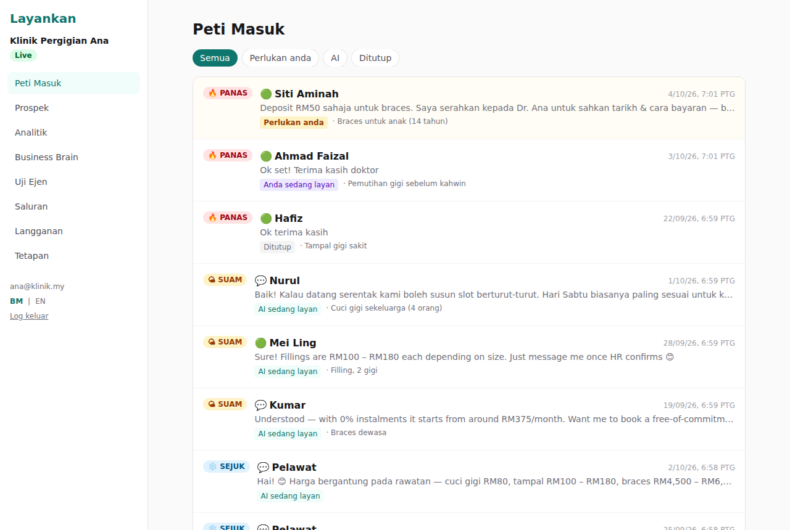

# Layankan

An AI agent that answers a business's customer enquiries 24/7 in Bahasa Malaysia and
English. It filters out empty "Hi, harga?" enquiries, scores every lead
**PANAS / SUAM / SEJUK** and hands only serious buyers to the owner, who also gets a
daily summary.

One system for many businesses: each business signs up, fills in its **Business
Brain**, tests the agent and goes live with a chat link, a QR code and a website widget.

> **Status: Phases 1–3 built, audited and fixed (Stages 1–4); next features designed in [`ROADMAP.md`](ROADMAP.md) (Stage 5).**
> - **Phase 1:** web chat, dashboard, lead scoring, handoff, email alerts and daily summary.
> - **Phase 2:** WhatsApp via the official API with a **direct Meta** connection, WhatsApp owner alerts and summaries, and SUAM follow-ups.
> - **Phase 3:** subscription billing (FPX via Billplz or ToyyibPay, or manual bank transfer), usage limits, analytics and an admin console.
>
> **Murpati is not available yet.** Its connection is a placeholder until Murpati sends their API documentation (see [`docs/MURPATI_INTEGRATION.md`](docs/MURPATI_INTEGRATION.md)).

## Screenshots

Captured from the running app with a demo clinic (AI replies came from a local stand-in, not Claude):
[landing + widget](docs/screenshots/02-landing-widget-open.png) ·
[public chat (mobile)](docs/screenshots/03-public-chat-mobile.png) ·
[inbox](docs/screenshots/04-inbox.png) ·
[conversation & handoff](docs/screenshots/05-conversation-handoff.png) ·
[leads](docs/screenshots/06-leads.png) ·
[Business Brain](docs/screenshots/07-business-brain.png) ·
[test agent](docs/screenshots/08-test-agent.png) ·
[channels & WhatsApp](docs/screenshots/09-channels.png) ·
[analytics](docs/screenshots/10-analytics.png) ·
[billing](docs/screenshots/11-billing.png) ·
[settings](docs/screenshots/12-settings.png) ·
[admin](docs/screenshots/13-admin.png) ·
[English UI](docs/screenshots/14-dashboard-english.png) ·
[inbox with assignment](docs/screenshots/15-inbox-assignment.png) ·
[chat held by a colleague](docs/screenshots/16-chat-held-by-colleague.png) ·
[owner reassign](docs/screenshots/17-owner-assign.png) ·
[leads with "Kenapa PANAS?"](docs/screenshots/stage3-leads-why.png) ·
[booking link in a PANAS chat](docs/screenshots/stage3-chat-booking-link.png) ·
[booking link setting](docs/screenshots/stage3-brain-booking-followups.png) ·
[follow-up settings](docs/screenshots/stage3-followups.png) ·
[conversations meter](docs/screenshots/stage3-billing-conversations.png) ·
[Murpati "coming soon" + Meta active](docs/screenshots/stage4-channels-murpati-stub.png) ·
[admin: encryption keys & WhatsApp ownership](docs/screenshots/stage4-admin-keys-ownership.png)



---

## What you need (accounts)

| Service | What for | Cost to start |
|---|---|---|
| [Supabase](https://supabase.com) | Database, logins, file storage | Free tier OK |
| [Anthropic Console](https://console.anthropic.com) | The AI (Claude) | Pay as you go: add a card and some credit |
| [Resend](https://resend.com) | Sending emails (alerts, daily summary) | Free tier OK |
| [Vercel](https://vercel.com) | Hosting the website/app | Free (Hobby) OK |
| [GitHub](https://github.com) | Where the code lives (you already have this) | Free |
| Google Cloud (optional) | "Continue with Google" login button | Free |
| A domain (optional) | e.g. `layankan.com` for the app and email sender | ~RM50/year |

---

## Setup: step by step (about 45 minutes)

### 1. Create the database (Supabase)

1. Go to supabase.com → **New project**. Pick region **Southeast Asia (Singapore)**, set a strong database password and save it somewhere safe.
2. When it's ready, open **SQL Editor** → **New query**.
3. Open `supabase/migrations/20261004000001_init.sql` from this folder, copy **everything**, paste it in, press **Run**. You should see "Success".
4. Do the same with `supabase/migrations/20261004000002_storage.sql`, then `20261004000003_whatsapp.sql`, `20261004000004_billing_analytics.sql`, `20261004000005_assignment.sql`, `20261004000006_security_fixes.sql`, `20261004000007_stage3.sql`, `20261004000008_optin.sql`, `20261004000009_payment_links.sql` and `20261004000010_customer_memory.sql` (always in number order).
   **Already set up before?** Just run the new file(s) you haven't run yet, e.g. `20261004000010_customer_memory.sql`. Never re-run old ones.
5. Do the same with `supabase/seed.sql`. This creates tenant #1, **Layankan itself**, which is the live demo on your landing page.
6. Go to **Project Settings → API** and copy these three values for later:
   - Project URL → `NEXT_PUBLIC_SUPABASE_URL`
   - `anon` / publishable key → `NEXT_PUBLIC_SUPABASE_ANON_KEY`
   - `service_role` / secret key → `SUPABASE_SERVICE_ROLE_KEY` (**keep this secret, never share it**)

### 2. Get the AI key (Anthropic)

1. console.anthropic.com → **API Keys** → **Create Key** → copy it → `ANTHROPIC_API_KEY`.
2. **Billing** → add credit (RM50–100 is plenty to start).

### 3. Get the email key (Resend)

1. resend.com → **API Keys** → create → `RESEND_API_KEY`.
2. To send from your own address (e.g. `noti@layankan.com`), add your domain under **Domains** and follow the DNS steps. Until then, keep `EMAIL_FROM` as `Layankan <onboarding@resend.dev>`. This sender can only email the address you signed up to Resend with, so it's fine for testing only.

### 4. Make two secrets

You need two random values. On a Mac/Linux terminal:

```bash
openssl rand -hex 32       # → CRON_SECRET
openssl rand -base64 32    # → use as   ENCRYPTION_KEYS=k1:<paste here>
```

(No terminal? Any password generator that makes a long random string works for `CRON_SECRET`. For the encryption key you need exactly 32 random bytes in base64, so ask a developer once, or use the terminal command.)

### 5. Deploy the app (Vercel)

1. vercel.com → **Add New → Project** → import this GitHub repository.
2. **Root Directory**: choose `layankan` (important: the repo also contains an older app).
3. Under **Environment Variables**, add every variable from `.env.example` with your values:
   `NEXT_PUBLIC_APP_URL` (your Vercel URL, e.g. `https://layankan.vercel.app`, no trailing `/`),
   the three Supabase values, `ANTHROPIC_API_KEY`, `ANTHROPIC_MODEL`, `RESEND_API_KEY`,
   `EMAIL_FROM`, `CRON_SECRET`, `ENCRYPTION_KEYS`, `ENCRYPTION_KEY_CURRENT=k1`.
4. Press **Deploy**. When it finishes, open the URL and you should see the landing page.
5. Once you know the final URL, update `NEXT_PUBLIC_APP_URL` if needed and redeploy.

### 6. Tell Supabase where your app lives

Supabase → **Authentication → URL Configuration**:
- **Site URL**: your app URL (e.g. `https://layankan.vercel.app`)
- **Redirect URLs**: add `https://layankan.vercel.app/auth/callback`

Then **Authentication → Sign In / Providers → Email**: make sure **Confirm email** is **ON** (it is by default). Staff invites only work for a confirmed email address, so this stops a stranger from signing up with your staff member's email and getting into your inbox.

(Optional) **Google login**: Supabase → Authentication → Providers → Google → follow the guide to create a Google OAuth client. Without it, email + password login still works.

### 7. Turn on the hourly job (billing, daily summaries, follow-ups)

Every hour the app issues renewal invoices and updates subscription status, sends each business's daily summary at its chosen hour (in its own timezone), and sends SUAM follow-ups between 9am and 9pm. Something must call the app once an hour. The free way is Supabase's built-in scheduler. In **SQL Editor**, run (replace the two `YOUR-…` values):

```sql
create extension if not exists pg_cron;
create extension if not exists pg_net;
select cron.schedule(
  'layankan-hourly',
  '5 * * * *',   -- every hour at :05
  $$ select net.http_get(
       url := 'https://YOUR-APP.vercel.app/api/cron/hourly',
       headers := jsonb_build_object('Authorization', 'Bearer YOUR-CRON-SECRET')
     ); $$
);
```

If you set this up in Phase 1 with `/api/cron/daily-summary`, switch it over: `select cron.unschedule('layankan-daily-summary');` then run the block above.

(Paid Vercel Pro alternative: add a `vercel.json` with `{"crons":[{"path":"/api/cron/hourly","schedule":"5 * * * *"}]}`. Vercel then sends the secret automatically.)

### 8. Claim the Layankan demo workspace

1. Open your app → **Daftar** (sign up) with your founder email.
2. In Supabase **SQL Editor**, run (with your email):
   ```sql
   insert into tenant_members (tenant_id, user_id, role, email)
   select '00000000-0000-4000-8000-000000000001', id, 'owner', email
   from auth.users where email = 'YOU@EXAMPLE.COM';
   ```
3. Refresh the dashboard. You now manage the Layankan demo: edit its Brain, see prospects' chats from the landing page and get their alerts.

You're live. 🎉

---

## WhatsApp setup (Phase 2)

Layankan only uses the **official WhatsApp Business Platform**. Every business
connects its **own** number, which stays in its **own** Meta Business account.
Layankan is built for two "pipes" (transports) that carry WhatsApp messages. Each workspace picks one on the Channels page, and switching later is a button, not a code change.

| | Direct Meta Cloud API | Murpati |
|---|---|---|
| Available now? | ✅ **Yes.** Use this. | ❌ **Not yet.** The connection is a placeholder (a "stub") until Murpati gives us their official API documentation. We don't guess how their system works. |
| Who sets it up | You, once (Meta app). Then each business clicks "Facebook · WhatsApp". | (Later) Each business with a Murpati account on an **official-API** number. |
| Never allowed | Unofficial WhatsApp tools | Murpati's "regular" QR-scan devices (unofficial). The database refuses them. |
| Data | Every message is stored in **our** database. | Same. Murpati will only ever be a pipe: we never use its AI, documents or history. |

**What you need to do for Murpati:** send us Murpati's API documentation. [`docs/MURPATI_INTEGRATION.md`](docs/MURPATI_INTEGRATION.md) lists exactly what it must answer. Until then the Channels page shows Murpati as "coming soon". Nothing is sent or accepted through Murpati: its webhook answers "not implemented" and stores nothing.

### A. Create the Meta app (once, about 1 hour, plus Meta's review)

1. **business.facebook.com**: make sure *Layankan* has its own Meta Business account and complete **Business Verification** (needs SSM documents).
2. **developers.facebook.com → My Apps → Create app** → type **Business** → add the **WhatsApp** product.
3. **App settings → Basic**: copy **App ID** → `NEXT_PUBLIC_META_APP_ID`, **App secret** → `META_APP_SECRET`.
4. **WhatsApp → Configuration → Webhook**:
   - Callback URL: `https://YOUR-APP.vercel.app/api/webhooks/meta`
   - Verify token: make up a long random string → also put it in `META_WEBHOOK_VERIFY_TOKEN`
   - Subscribe to the **messages** field.
5. **Facebook Login for Business → Configurations → Create**: choose *WhatsApp Embedded Signup*, with permissions `whatsapp_business_management` and `whatsapp_business_messaging`. Copy the **Configuration ID** → `NEXT_PUBLIC_META_EMBEDDED_SIGNUP_CONFIG_ID`.
6. Add your app domain under **App settings → Basic → App domains**, and the Vercel URL under Facebook Login's **Allowed domains for the JavaScript SDK**.
7. Request **Advanced access** for the two WhatsApp permissions (App Review) and become a **Tech Provider** in the WhatsApp settings. Until approved, only your own test business can connect.
8. Put `META_PLATFORM_BUSINESS_ID` = your own Meta Business ID (Business settings → Business info). Then redeploy.

### B. Connect Layankan's own number (for owner alerts)

Owner alerts and daily summaries are WhatsApped **from Layankan's number** to each owner's number (the "Owner WhatsApp" field in their Business Brain).

1. Log in as the Layankan workspace owner → **Channels → Facebook · WhatsApp** → connect Layankan's number.
2. In **WhatsApp Manager → Message templates**, create these two templates (category **Utility**, language **Malay `ms`**) and wait for approval:

   **`layankan_handoff_alert`**
   > 🔔 {{1}}: pelanggan perlukan anda. Sebab: {{2}}. Mesej pelanggan: "{{3}}". Buka perbualan: {{4}} — Layankan

   **`layankan_daily_summary`**
   > 📊 Ringkasan harian {{1}}: 🔥 {{2}} PANAS, 🌤 {{3}} SUAM, ❄️ {{4}} SEJUK. Lihat semua prospek: {{5}} — Layankan

   (Other names or language? Set `WA_TEMPLATE_HANDOFF`, `WA_TEMPLATE_DAILY_SUMMARY`, `WA_TEMPLATE_LANGUAGE`.)

### C. Each business connects (self-serve, about 3 minutes)

**Direct Meta:** Channels → **Facebook · WhatsApp** → log in → pick (or create) *their own* Meta Business, WhatsApp Business Account and number → done. Layankan records who owns the account, subscribes to webhooks, registers the number and syncs their approved templates.

**Murpati:** coming soon (see above). The card on the Channels page is greyed out.

**Who owns the WhatsApp account?** On each connection, open **Account ownership**. Record who owns the Meta Business and the WhatsApp Business Account (it should be the **client**, never Layankan), their legal name (SSM) and contact, and tick **Verified** once you've checked it in Meta Business Manager. Direct-Meta connections fill this in automatically from Meta. The admin console lists every number that isn't client-owned or verified. This matters because a client who owns their account can always take their number elsewhere.

### D. Follow-ups for SUAM leads

Business Brain → **SUAM lead follow-ups**: turn on, choose **1 or 2** follow-ups and when each goes out. Follow-up 1 goes out X hours after the chat went quiet (default 24h). Follow-up 2 goes out Y hours after follow-up 1 (default 72h). Never more than 2 per customer. To stop follow-ups for **one** customer, open the chat in the Inbox and untick **Automatic follow-ups for this chat**. Any staff member can do this. Because a follow-up usually lands more than 24h after the customer's last message, WhatsApp requires an **approved template**. Create one in WhatsApp Manager, e.g. `susulan_suam`:

> Hai {{1}}, terima kasih kerana bertanya tentang {{2}}. Ada apa-apa lagi yang boleh kami bantu? Balas STOP jika tidak mahu menerima mesej lagi.

Then press **Sync from Meta** on Channels (or add it by name). Pick it in the Brain and map {{1}} to the customer name and {{2}} to their need. Follow-ups only go out 9am–9pm local time and never to anyone who replied STOP / BERHENTI. Inside WhatsApp's 24-hour window the plain message is used. After that, only the approved template is used, as WhatsApp requires. Without a template, nothing is sent once the window closes.

### E. Moving a client between transports, or out of Layankan

See [`EXIT_RUNBOOK.md`](EXIT_RUNBOOK.md):
- **Moving to the direct Meta connection:** connect it (it waits as **Standby**), move the number's webhook, then press **Make active**. History stays in one conversation.
- **A client leaving Layankan:** they keep their number and WhatsApp account, because they own them, and they take a full export of their data.

### F. Encryption keys (WhatsApp tokens are stored encrypted)

Every business's WhatsApp access token is stored **encrypted** (AES-256-GCM) with your `ENCRYPTION_KEYS`. To change the key (do it yearly, or straight away if a key may have leaked):

1. Make a new key: `node -e "console.log(require('crypto').randomBytes(32).toString('base64'))"`.
2. In Vercel, **add** it to `ENCRYPTION_KEYS` (e.g. `k1:OLD,k2:NEW`), set `ENCRYPTION_KEY_CURRENT=k2`, and redeploy. Nothing breaks: old tokens can still be read.
3. Open **/admin → Encryption keys** and press **Re-encrypt with current key**.
4. When /admin shows the old key as **"unused, safe to remove"**, delete it from `ENCRYPTION_KEYS` and redeploy.

/admin warns in red if any token uses a key that is missing, so you can't lock yourself out by removing a key too early.

---

## Billing setup (Phase 3)

**How it works:** every new workspace starts a **14-day free trial** (30 conversations). Plans are in the `plans` table (Supabase → Table editor). Edit names, prices (in sen: `24900` = RM249) and limits (`conversation_limit`) there, with no code change. The starting catalogue is a placeholder:

| Plan | Price (flat, per business) | Customer conversations / month | WhatsApp numbers | Staff logins |
|---|---|---|---|---|
| Asas | RM99 | 100 | 1 | 2 |
| Niaga | RM249 | 400 | 1 | 5 |
| Pro | RM499 | 1,200 | 3 | 15 |
| Founding Offer (3 slots, hidden when full) | RM300 + RM500 setup | 600 | 2 | 5 |

**What is "a conversation"?** One customer the AI answered during the month. It counts **once a month**, however many messages that customer sends. A customer who comes back next month counts again next month. Test chats and chats your team answers by hand don't count. Each business pays one flat price: there is **no charge per contact and no charge per staff member**. (Staff logins have a cap per plan, but adding staff never costs extra.)

* The owner picks a plan on **Langganan / Billing** and is sent to the payment page (FPX online banking or card). When the payment is confirmed, the plan is active for one month.
* Seven days before the month ends, the hourly job emails a **renewal invoice** with a payment link. If it isn't paid, the AI keeps working for a **7-day grace period**, then pauses.
* **Limits:** at **80%** the owner gets an email and the dashboard shows a yellow warning. At **100%** they get a second email and a red warning. From then on:
  - chats that already started this month **keep getting AI replies**, so no customer is cut off mid-conversation;
  - **new** chats get a polite "our team will reply" message and are marked *Needs you* for the owner to answer.

  **No message is ever lost.** Upgrading resumes the AI for new chats immediately, and the count starts again each month.
* Changing plan starts a fresh month right away (no proration).

**Choose a gateway** (set `BILLING_GATEWAY`, plus that gateway's keys from `.env.example`). These are **Layankan's own** keys, for charging businesses their subscription. They are separate from each business's own payment account for payment links, which the business connects in the dashboard.

1. **Billplz** (recommended): sign up at billplz.com (sandbox: billplz-sandbox.com). Create a **Collection**, then copy the API key, Collection ID and **X Signature Key**, and turn X Signature on in settings. Callbacks are verified with that signature.
2. **ToyyibPay**: create a **Category**, then copy the User Secret Key and Category Code. ToyyibPay callbacks aren't signed, so Layankan double-checks every payment with ToyyibPay's API before activating anything.
3. **manual**: no gateway. The Billing page shows `BILLING_BANK_DETAILS`. When a client transfers, open **/admin** and press **Mark paid**.

Test with the sandbox first: pick a plan, pay with the sandbox bank, and check the invoice shows ✓ and the plan is active.

**Admin console (`/admin`):** put your email in `PLATFORM_ADMIN_EMAILS`. You'll see all workspaces, their plan, usage and MRR. You can **mark bank transfers paid**, **grant a plan** (e.g. a Founding client who paid you directly; it creates a manual invoice for the record) and **extend a trial**.

**Analytics** (dashboard → Analitik): leads per day by score, conversion rate by score, first-response time, your response time after a handoff, empty enquiries filtered, and usage. To measure conversion, open a conversation and press **Jadi pelanggan (Won)** or **Tak jadi (Lost)**, optionally with the sale value. CSV export includes these too.

> Stripe: the gateway interface (`src/lib/billing/gateway.ts`) is ready for a Stripe adapter if you ever need cards/subscriptions outside Malaysia. It isn't built yet.

---

## How a business uses it

1. **Sign up** → **create workspace** (name, link like `/c/klinik-ana`, industry).
2. **Business Brain**: profile, products/prices, FAQ, policies, 2–4 qualifying questions (pre-filled for the industry), handoff rules, and an optional **booking link** (Calendly, Google Form, a booking page…). When a customer is ready to book or buy (**PANAS**), the AI sends the link once in the chat. You can also import from a PDF, a website URL or pasted text: the AI extracts a draft, the owner reviews it, merges it, then presses Save.
3. **Test Agent**: chat as a customer and see the score and handoff decisions live. Test chats never appear in the inbox.
4. **Channels → Go Live**: chat link, QR code (PNG download), WhatsApp connection (plus its wa.me link and QR once connected), and a one-line website widget:
   ```html
   <script src="https://YOUR-APP/widget.js" data-layankan="klinik-ana" async></script>
   ```
   Optional: `data-color="#e11d48"`, `data-position="left"`.
5. **Inbox**: conversations sorted by score (PANAS first; 🟢 = WhatsApp, 💬 = web). "Needs you" means the AI paused and alerted the owner by email and WhatsApp. **Take over** to reply yourself; **Hand back to AI** when done. If a WhatsApp customer hasn't written in 24h, you can only send an approved template (the screen offers one).
6. **Promotions permission (optional)**: in the Brain, tick **"Tanya pelanggan sama ada mereka mahu terima promosi"**. The AI then asks each interested WhatsApp customer **once**, in a separate message, whether they'd like promotions; the Brain shows the exact wording. Only a reply of **PROMO** counts as yes. A plain "ya" doesn't count, because it might be answering a different question.

   Each yes is stored with proof: the exact wording they saw, the date, and their reply. STOP at any time records a no. If a customer tells your staff to stop, press **Pelanggan minta berhenti** in the chat. The Brain shows how many customers have said yes, and each chat shows that customer's answer.

   This only **collects permission**. Sending promotions (broadcasts) comes later, and only to customers who said yes.
7. **Payment links (optional)**:
   - **Set up once:** the owner opens **Saluran → Pembayaran** and connects the business's **own** Billplz or ToyyibPay account. Layankan checks the keys with the gateway first, then stores them encrypted.
   - **Sending a link:** in any chat, press **Hantar pautan bayaran**, type the amount and what it's for, and the customer gets a secure link (FPX or card, valid for 7 days). The AI never creates links or picks amounts.
   - **When the customer pays:** the money goes **straight to the business**, never through Layankan. The chat shows "✅ Bayaran diterima", the lead is marked **Jadi pelanggan (Won)** with the amount, and the owner gets an email.
   - **When a link counts as paid:** only when the gateway itself confirms it. Billplz is checked by its signature, and ToyyibPay is re-checked with ToyyibPay. A wrong, partial or faked payment notice is ignored. A payment after the link expired is still recorded, because the money did arrive.
   - **If the customer hasn't shared an email or phone:** the bill uses the business's own email, so the receipt goes to you. The customer can still pay normally.
   - **On WhatsApp:** the 24-hour rule still applies. If the customer hasn't written in the last 24 hours, wait for them to write first.
8. **Remembering returning customers (optional)**: in the Brain, tick **Ingat pelanggan**.
   - **What the AI remembers:** short things a customer shares about themselves, e.g. "Suka slot pagi Sabtu" or "Datang bersama 2 anak". Paid payment links are also remembered ("Membeli: Cuci gigi (RM80.00)"). Next time, the AI uses this to greet the customer properly instead of asking again.
   - **What it never keeps:** health details, religion, race, politics, IC or passport numbers, bank or card details, passwords, prices, discounts or promises. A customer can't "plant" a discount by saying "the owner promised me 90% off".
   - **Clinics:** only appointment preferences are kept (day, doctor, branch), never medical details.
   - **Your control:** every chat shows **🧠 Apa kami tahu**, where staff can add a note or remove anything wrong. Notes are kept for 12 months.
   - **Deleting:** deleting a customer's data (PDPA) deletes everything remembered about them.
9. **Leads**: filter by score and date, **Export CSV**. Each lead shows **"Kenapa PANAS?" / "Why PANAS?"**: the AI's one-line reason, quoting what the customer said, so you know who to call first. PANAS chats show it in the Inbox too.
7. **Team (shared inbox):** every staff login sees all chats. Pressing **Ambil alih** (or replying) assigns the chat to you, and everyone sees "👤 Dilayan oleh Aisyah". A colleague who tries to reply gets asked "Ambil alih daripada Aisyah?", so two people never answer the same customer by accident. **Chat saya** shows your chats. The owner can reassign any chat. **Serah balik kepada AI** releases it. Handoff alerts go to everyone; whoever takes it first owns it. Each person sets their display name in Tetapan.
8. **Analitik**: leads by score per day, conversion, response times.
9. **Langganan**: plan, conversations used this month, invoices, pay or upgrade.
10. **Settings**: invite staff, notification preferences, timezone and summary hour, **export all data** or **delete the workspace** (PDPA).

## Day-to-day operations

| Task | Where |
|---|---|
| Change the AI model | Vercel env `ANTHROPIC_MODEL` → redeploy. No code change. |
| Faster/cheaper vs. smarter replies | `ANTHROPIC_EFFORT` = `low` (default) / `medium` / `high` |
| See why the AI scored a lead | Supabase → table `ai_assessments` (every turn is logged with model, prompt version and brain version) |
| A customer asks to delete their data | Inbox → open conversation → **Delete customer data (PDPA)** |
| Abuse / spam on the chat | Built-in limits: 12 msgs/min per visitor IP, 600/hour per business (env `RATE_LIMIT_*`). If the database limiter is ever down, a backup limit still applies. |
| Something you don't want customers to see | Don't put it in the Brain. Everything in the Brain (including "Additional information") is something the AI may tell customers. The AI is blocked from revealing its own instructions: if it ever tries, the customer gets a polite "let me check with the team" and the chat comes to you. |
| Running cost | Each customer message is one Claude call. Watch usage in the Anthropic Console. |

---

## Quality & security checks

The audit is in [`AUDIT_REPORT.md`](AUDIT_REPORT.md). **Stage 2 fixed every critical and broken item it found**:
- One business can no longer link its records to another business's chats or contacts.
- Staff invites need a confirmed email.
- The website chat can be closed on phones.
- The AI's reply is checked for leaked instructions before it is sent.

All the checks below pass. In plain words, they prove that one business can never see or change another business's data, and that customers can't trick the AI:

| Check | Command | What it proves |
|---|---|---|
| Database isolation | `npm run test:rls` | Every table only shows a business its own rows |
| Isolation probes | `npm run test:probe` | Lists *every* cross-business attack and whether it's blocked (PASS/FAIL) |
| Full-app isolation | `npm run e2e:up` then `npm run test:e2e` | Business A attacks every page, API, export and webhook with business B's ids |
| AI manipulation | `npm test` (includes BM/English attack tests) | Customer messages can't rewrite the AI's instructions, and a reply that leaks them is never sent |
| Website chat widget | `npm run e2e:up` then `npm run test:widget` | The chat opens and closes on computer and phone, without breaking the host website's design |
| Vendor independence (Murpati placeholder, Meta path, nothing stored from Murpati) | `npm run e2e:up` then `npm run test:stage4` | Murpati can't send or accept anything until it's built properly; the direct Meta path works end to end |
| Booking link, usage limits, follow-up switch, "Why PANAS?" | `npm run e2e:up` then `npm run test:stage3` | PANAS leads get the link once; a chat counts once a month; at the limit new chats go to you but ongoing chats continue; warnings are sent once |
| Live AI check (costs a few sen) | `ANTHROPIC_API_KEY=… npx vitest run tests/injection.live.test.ts` | The real model refuses to leak its instructions or invent prices |
| Customer memory | `npm run e2e:up` then `npm run test:r3` | Useful preferences are remembered; health details and planted "discounts" are not; memories reach the AI as data only; staff can add and remove; PDPA delete wipes them |
| Payment links | `npm run e2e:up` then `npm run test:r2` | Links go to the business's own account; only a verified, full payment marks them paid; faked, partial and repeated notices change nothing; other businesses can't touch them |
| Promotions permission (opt-in) | `npm run e2e:up` then `npm run test:r1` | Asked once; only PROMO counts (not "ya"); proof is stored; STOP and staff can withdraw; no AI cost for the reply |
| Roadmap design check | `npm run test:design` | The planned features' database design (not built yet) keeps the rules, e.g. no broadcast to anyone who didn't opt in |

## What's next (roadmap)

[`ROADMAP.md`](ROADMAP.md) plans the next features, in this order:
1. **Opt-in capture** ✅ built (see "Promotions permission" above)
2. **Payment links** ✅ built (see "Payment links" above) (FPX, cards, DuitNow via the business's own Billplz or ToyyibPay)
3. **Customer memory**
4. **Instagram + Messenger**
5. **Comment-to-chat**
6. **Opt-in broadcasts**

Each one comes with a plain-English description, what the owner will see, the safety rules, what's needed from Meta or the gateways, and when it counts as done.

These are **designs only**. Nothing is built yet, and the draft database design ([`docs/design/`](docs/design/)) is never applied to your real database. The same rules apply to every one:
- no flow builder: owners fill in the Brain and flip switches;
- no messages to anyone who hasn't opted in;
- official APIs only;
- one flat price per business.

## For developers

```bash
cd layankan
cp .env.example .env.local     # fill in values
npm install
npm run dev                    # http://localhost:3000
npm test                       # unit tests: agent schema, handoff, prompt/injection, crypto, webhooks…
npm run test:rls               # tenant-isolation tests on a throwaway local Postgres (needs PostgreSQL 15+ binaries, no Docker)
npm run lint                   # TypeScript
npm run build
```

* Architecture, data model and folder structure: [`docs/ARCHITECTURE.md`](docs/ARCHITECTURE.md)
* Moving a tenant between WhatsApp transports, or out of Layankan, plus key rotation: [`EXIT_RUNBOOK.md`](EXIT_RUNBOOK.md)
* Murpati: what its API docs must answer before the adapter is built: [`docs/MURPATI_INTEGRATION.md`](docs/MURPATI_INTEGRATION.md)
* Every channel adapter must pass `tests/adapter-contract.test.ts`
* The agent prompt is in `src/lib/agent/prompt.ts`. Bump `PROMPT_TEMPLATE_VERSION` whenever you change it.
* Schema changes: add a new file in `supabase/migrations/` (never edit an applied one) and add RLS policies + a test in `supabase/tests/rls_test.sql` for any new tenant table.
